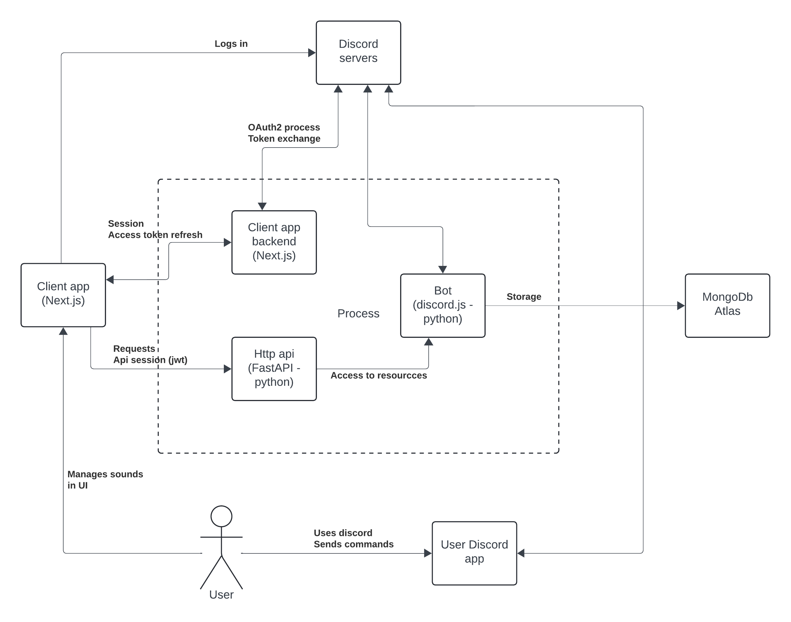

## Cíl projektu
Cílem projektu bylo vytvořit ovládací panel pro discord bota. Potřeba pro to vznikla ve chvíli, kdy jsem chtěl přidat možnost 
nahrávat vlastní zvuky uživatelům bota. Předcchozí možnost zahrnující posílání linků na Google Drive a následné stahování a 
ukládání z něj se ukázala velmi nepraktická. Hlavním účelem aplikace je tedy zobrazovat, přehrávat, stahovat, přidávat a 
odstraňovat zvukové soubory. Ty jsou pro každý server na kterém je bot přítomný jiné (tedy až na malé množství defaultich zvuků).

## Scháma fungování
Jednotlivá bloky aplikace fungují podle následujícího schámatu:  

## Popis implementovaných požadavků
|Název|Splněno|Poznámky|
|---|---|---|
|b|b|
